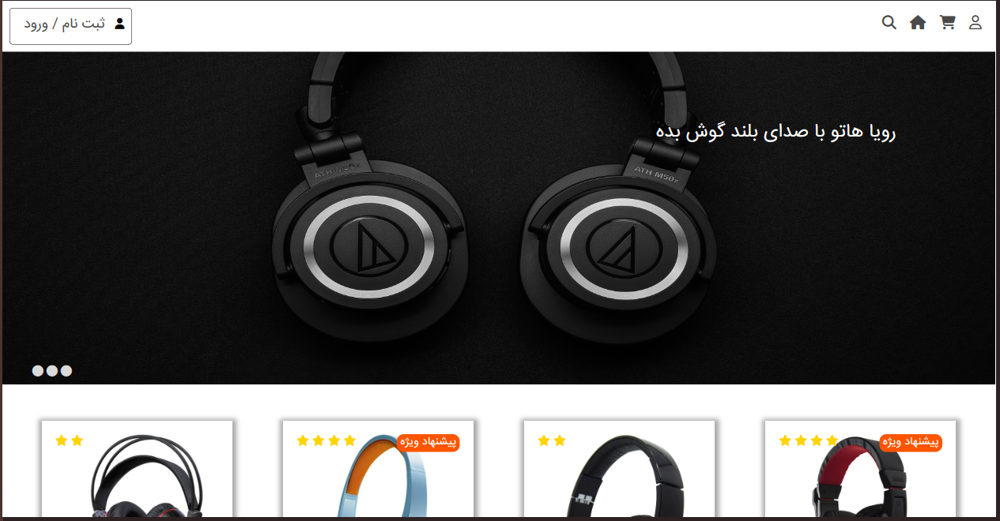
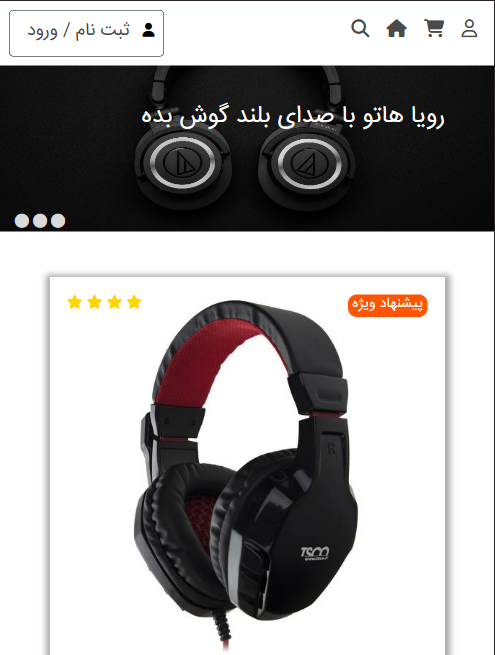
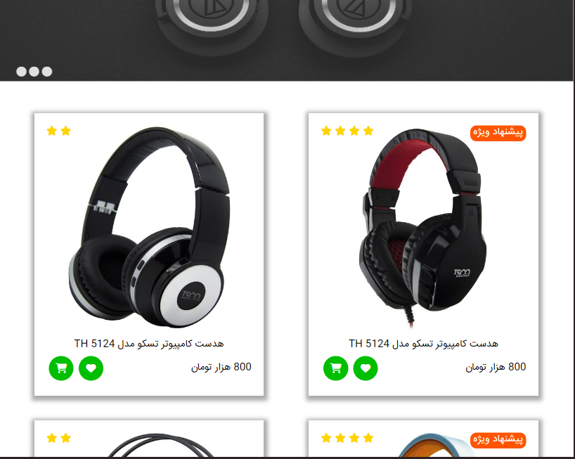

# Store


## Overview

Store is a modern, user-friendly e-commerce web application designed to showcase a variety of products, including special offers and featured items. It provides an engaging interface with a slider, categorized products, and interactive components like a carousel for enhanced user experience. Built with HTML, CSS, and JavaScript, this project demonstrates essential e-commerce functionality and serves as a portfolio project to showcase development skills.

## Prerequisites

- **Node.js** (for potential development purposes if additional features are added)
- Basic understanding of HTML, CSS, and JavaScript
- Web browser (Chrome, Firefox, or similar)

## Installation

1. Clone the repository:
   ```bash
   git clone https://github.com/sajjad-sisakhtpour/store.git
   ```
2. Navigate to the project directory:
   ```bash
   cd store
   ```
3. Open the project in a web browser:
   - Simply open `index.html` in any web browser.

## Usage

- **Navigation**: The navbar provides links for user registration, cart, home, and search functionalities.
- **Slider**: Features product highlights and promotions.
- **Product Cards**: Each product card displays the product image, rating, and price, with options to add to wishlist or purchase.

## Examples

- **Viewing Products**: Users can browse products by navigating through various categories.
- **Special Offers**: Special offers are highlighted with a countdown timer to encourage timely purchases.
- **Carousel Interaction**: Products can be browsed in a carousel, enhancing user experience.

## Documentation

- `index.html`: Main structure of the application, contains the layout of the web page.
- `main.css`: Primary styling file for overall layout and design.
- `animate.css`, `flexboxgrid.css`, `owl.carousel.min.css`, `owl.theme.default.min.css`: External CSS files for animations, grid layouts, and carousel functionality.

## Screenshots





## Live Demo

Access the live demo [here](https://github.com/sajjad-sisakhtpour/store).

## Contributing

1. Fork the repository.
2. Create your feature branch (`git checkout -b feature/AmazingFeature`).
3. Commit your changes (`git commit -m 'Add some AmazingFeature'`).
4. Push to the branch (`git push origin feature/AmazingFeature`).
5. Open a pull request.

## License

This project is licensed under the MIT License. See the [LICENSE](LICENSE) file for details.

## Contact

- **Name**: Sajjad Sisakhtpour
- **Email**: [sajjad.sisakhtpour@gmail.com](mailto:sajjad.sisakhtpour@gmail.com)
- **GitHub**: [sajjad-sisakhtpour](https://github.com/sajjad-sisakhtpour)
- **LinkedIn**: [sajad-sisakht-pour](https://ir.linkedin.com/in/sajad-sisakht-pour)

---
